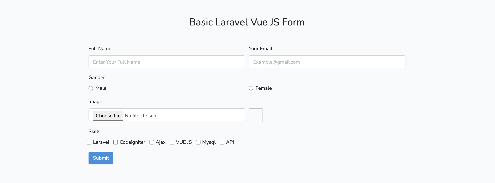
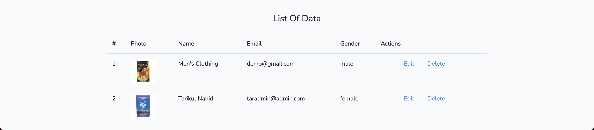

## Run Locally

## Screenshots



---



---

Clone the project

```bash
  git clone https://github.com/tarikulIslamNahid/laravel-vue-basic-form.git $PROJECT_NAME
```

Go to the project directory

```bash
  cd $PROJECT_NAME
```

Install Composer Dependencies

```bash
composer install
```

Create a copy of your .env file

```bash
cp .env.example .env
```

In the .env file, add database information to allow Laravel to connect to the database

terminal run:

```bash
php artisan key:generate

php artisan config:clear
```

Migrate the database

```bash
php artisan migrate
```

Start the server

```bash
  php artisan serve
```

## Author

-   [@Tarikul Islam](https://www.facebook.com/md.tarekul.313/)
